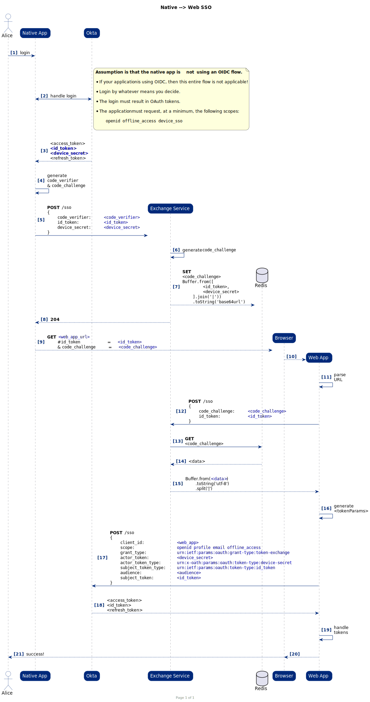

# native-sso-app

<p align="center">
	<a href="https://github.com/RichardLitt/standard-readme">
		
	</a>
	<a href="#contributors">
		
	</a>
	<a href="#license">
		
	</a>
	<a href="https://wakatime.com/badge/user/28857d2c-0688-4cac-b02c-d81ceead7b94/project/8c50d412-60ff-4cc9-bff1-22de72af7197">
		
	</a>
</p>
<br/>
<p align="center">
	
	
</p>
<br/>
<p align="center">
	<a href="https://vercel.com/new/clone?repository-url=https%3A%2F%2Fgithub.com%2Fokta-ciam-specialists%2Fnative-sso-app"></a>
	&nbsp;
	<a href="https://stackblitz.com/fork/github/okta-ciam-specialists/native-sso-app.git">
	
	</a>
</p>

A simple React SPA (powered by [Vite](https://vitejs.dev)) that represents a &#34;native&#34; application in order to initiate an OAuth compliant Native SSO to a secondary application.

TODO: Fill out this long description.

## Table of Contents

- [Background](#background)
- [Install](#install)
- [Usage](#usage)
- [Maintainers](#maintainers)
- [Contributing](#contributing)
- [License](#license)

## Background

### The "Standard" & History

Today, one of the most effective ways to maintain a seamless user experience across both web and mobile is to utilize a standard OpenID Connect authentication mechanism on both your mobile app and web app.

This allows the mobile application to take advantage of device OS capabilities that will permit the sharing of the Okta user session. By doing so, when a user logs into a website and then attempts to login to a native application, the native application will be able to recognize the web session and the user will "automagically" be authenticated without needing to enter their credentials.

Historically, companies like Google, Facebook, and Microsoft all implemented this normal OIDC authentication flow and many companies followed suit. However...

### The Problem

The OIDC authentication flow on native devices (namely Apple) is _not_ ideal. The user is prompted with an OS dialog and the flow is choppy. Many UX teams despise this method of authentication, even though it has significant advantages over "native" forms of authentication.

Due to the UX challenges, many companies, including Google, Facebook, and Microsoft, have moved _away_ from an OIDC authentication pattern in their native apps and have returned to the more "traditional" native/API-driven authentication (or more advanced options that we won't get into).

So how do we combat this? How can we provide our customers with a seamless experience and enable them to authenticate in both a native app and website _only once_?

### The Solution

[OpenID Native SSO](https://developer.okta.com/docs/guides/configure-native-sso/main/) to the rescue!

This OpenID specification was traditionally designed for native-to-native app SSO. However, we can also use this to enable native-to-_web app_ SSO.

#### What does this solve?

- Users can login to a native application using a native/API-driven authentication (non-OIDC compliant).
- Native applications can still "link out" to their website and seamlessly SSO their users so that they are "automagically" authenticated when they open the link.

#### Is this secure?

_Yes, and no_. This is always a subjective question. This mechanism assumes that a native application has implemented authentication _without_ using an OIDC Compliant mechanism. At Okta, we _support_ this but _we discourage_ it. There are tremendous benefits to using an OIDC Compliant authentication mechanism in a mobile application.

TODO - add benefits of OIDC Compliant mobile login

This does not mean that using a non-OIDC Compliant mechanism is necessarily _insecure_. It is a perfectly acceptable means to authenticate. But it does have some drawbacks.

The OIDC Native SSO implementation utilizes an `id_token` and `device_secret`. If not implemented correctly, there _can be_ security vulnerabilities.

Typically, native-to-native application communication is isolated to a single device and secured by device OS mechanisms so there are minimal concerns when sharing an `id_token` and `device_secret` between two apps. On Apple devices, for example, this is typically handled using [Apple's Keychain Services](https://developer.apple.com/documentation/security/keychain_services), resulting in a _very_ secure handshake.

This demonstration application utilizes _two_ single-page applications rather than a native application and web application _purely_ for the sake of keeping things simple. However, the two applications are isolated from each other and do not share any cookies/session information (otherwise that would defeat the purpose of this demo!).

The main security requirement is ensuring that the `device_secret` is _not_ intercepted. If a bad actor obtains the `id_token` **and** `device_secret`, they would be able to obtain as many tokens for that user as they want (_at least until the `device_secret` is revoked_). This is bad.

This implementation _borrows_ from the Authorization with PKCE flow to ensure that the backend function/service, which is acting as a "man in the middle", is a _trusted_ "man in the middle" and not a bad actor.

#### Can it be hacked?

Is anything _really_ un-hackable? ¯\\\_(ツ)\_/¯

_Hypothetically_... a bad actor could intercept an HTTPS request from the native app to the server, crack the encryption to get to the payload, and steal the `id_token`, and `device_secret`. That would be game over.

But, if a hacker does that... we have bigger issues on our hands as basically the entire security of the internet would need to be questioned!

#### So how does it work?

The basic setup is a "native" app, a web-based app, and a function/service with some sort of persistance layer (i.e. Redis). The two applications use a form of PKCE to securely exchange the `device_secret` with an intermediary -- the function/service.

The initiating app makes a **POST** request to the backend service with a `code_verifier`, `id_token`, and the `device_secret`, then opens a browser to the web app.

The web app also makes a **POST** request

<details>
	<summary>Sequence Diagram</summary>
	
</details>

---

<span style="color: red"><em><b>There are security vulnerabilities in this demo app. DO NOT copy the implementation as-is.</b></em></span>

---

## Install

```bash
npm install
```

### Configuration

By default, this project utilizes an existing Okta tenant. For local development, `http://localhost:3000` & `http://localhost:3000/login/callback` are allowed URLs.

You will need to spin up and use your own tenant if you need to use different redirect URLs or want to modify the configuration.

Follow the steps necessary to setup your application [here](https://developer.okta.com/docs/guides/configure-native-sso/main/#native-sso-flow).

Update the `.env` file with the appropriate values:

```env
VITE_OKTA_CLIENT_ID=
VITE_OKTA_ISSUER=
```

## Usage

### Running Locally

```bash
npm run dev
```

### Deploying

This application was initially deployed using Vercel. To deploy to your own instance, use the 'Deploy' button at the top of the page and follow Vercel's guide(s).

## Maintainers

[@eatplaysleep](https://github.com/eatplaysleep)

## Contributing

PRs accepted.

Small note: If editing the README, please conform to the [standard-readme](https://github.com/RichardLitt/standard-readme) specification.

## Contributors

<!-- ALL-CONTRIBUTORS-LIST:START - Do not remove or modify this section -->
<!-- prettier-ignore-start -->
<!-- markdownlint-disable -->
<table>
  <tbody>
    <tr>
      <td align="center" valign="top" width="14.28%"><a href="https://github.com/krishvenkatraman-okta-zz"><br /><sub><b>Krish Venkatraman</b></sub></a><br /><a href="https://github.com/eatplaysleep/native-sso-app/commits?author=krishvenkatraman-okta-zz" title="Ideas">🤔</a></td>
    </tr>
  </tbody>
  <tfoot>
    <tr>
      <td align="center" size="13px" colspan="7">
        
          <a href="https://all-contributors.js.org/docs/en/bot/usage">Add your contributions</a>
        </img>
      </td>
    </tr>
  </tfoot>
</table>

<!-- markdownlint-restore -->
<!-- prettier-ignore-end -->

<!-- ALL-CONTRIBUTORS-LIST:END -->

## License

MIT © 2023 Danny Fuhriman
